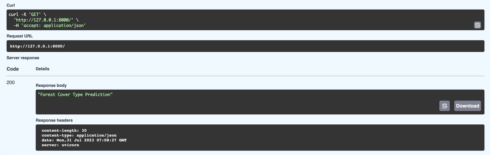
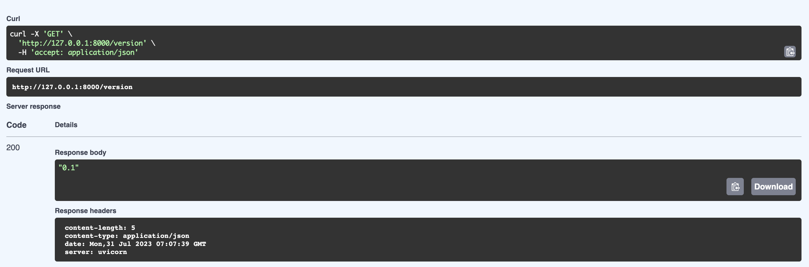
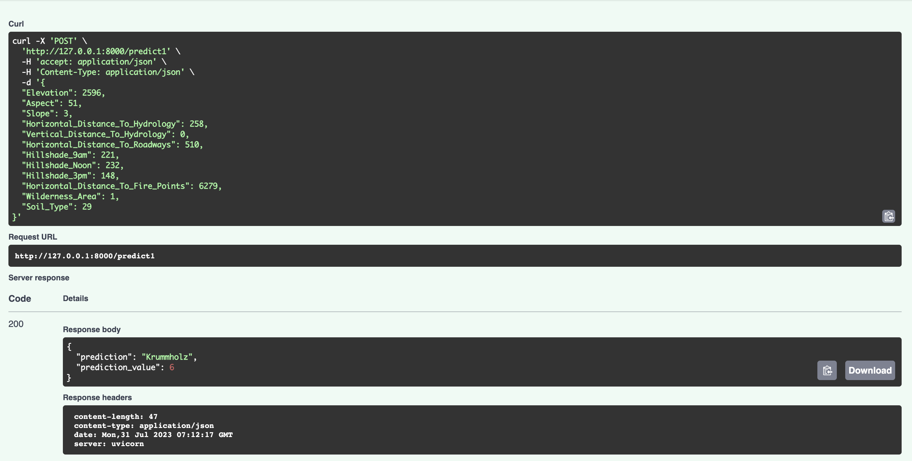
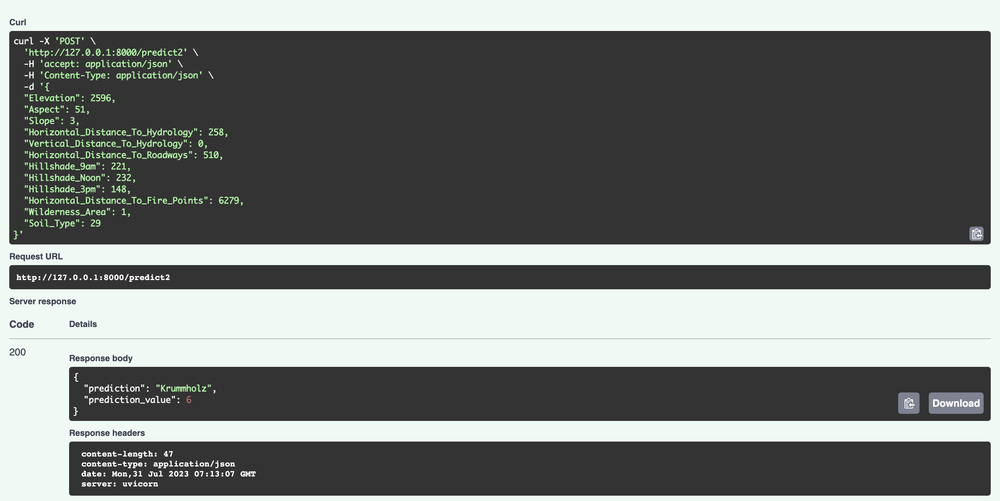
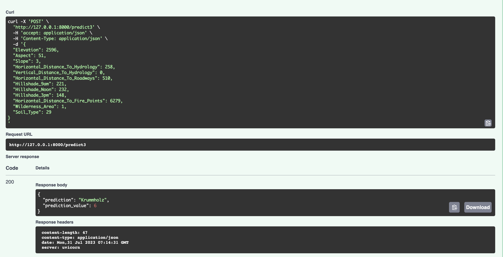
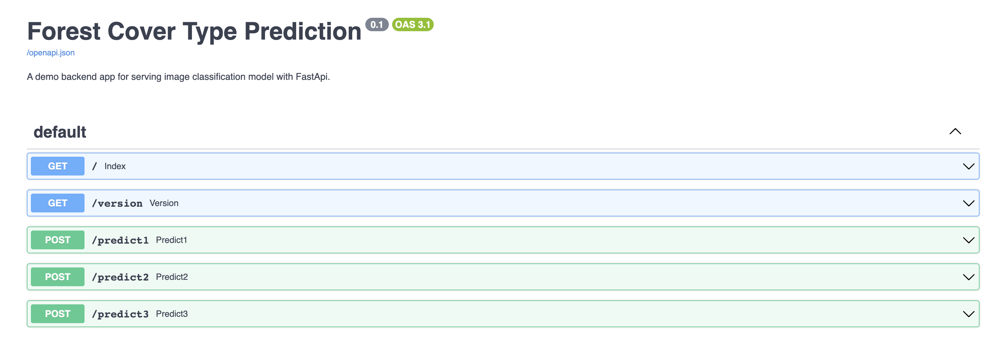

# Forest Cover Type Model Serve

# Introduction:
This project about the Forest Cover Type Prediction Backend API, which serves three supervised classification models for predicting forest cover types based on the Forest Cover Type Prediction dataset. The API provides endpoints to access the top classifier, 2nd best classifier, and the ensemble classifier.

# Endpoints:

1. **index (GET)**
- Endpoint: /index
- Description: Provides general information about the API.
- Response:

2. **version (GET)**

- Endpoint: /version
- Description: Provides the version information of the Forest Cover Type Prediction API.
- Response:

3. **predict1 (POST)**

- Endpoint: /predict1
- Description: Predicts the forest cover type using the top classifier (KNN).
- Response:

4. **predict2 (POST)**

- Endpoint: /predict2
- Description: Predicts the forest cover type using the 2nd best classifier (Decision Tree).
- Response:

5. **predict3 (POST)**

- Endpoint: /predict3
- Description: Predicts the forest cover type using the ensemble classifier (KNN, Decision Tree, MLP - top 3 classifier).
- Response:

# Docs Image:

# Model Information:

**Top Classifier:** KNN with an accuracy of 81.44%
**2nd Best Classifier:** Decision Tree with an accuracy of 79.57%
**Ensemble Classifier:** Comprising KNN, Decision Tree, and MLP with an accuracy of 84%

# Usage:

1. Start the backend server and ensure it is running on the desired port.
2. Use the provided endpoints to interact with the API:
    - Use /index and /version to obtain API information.
    - Send POST requests to /predict1, /predict2, and /predict3 with feature values to get predictions from the respective classifiers.
    - The responses will include the predicted forest cover type class.

# Conclusion:
The Forest Cover Type Prediction Backend API provides access to three classification models for predicting forest cover types. Users can make predictions using the top classifier (KNN), the 2nd best classifier (Decision Tree), and the ensemble classifier (KNN, Decision Tree, MLP - top 3 classifier). This API serves as a valuable tool for predicting forest cover types in different areas and can be easily integrated into various applications for real-world use cases.

